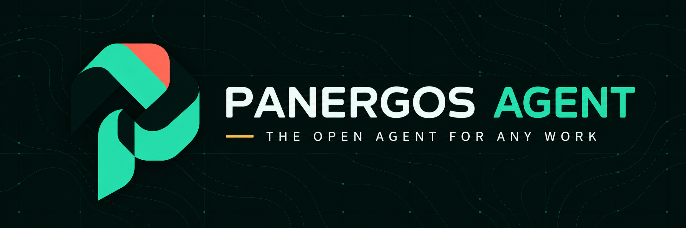
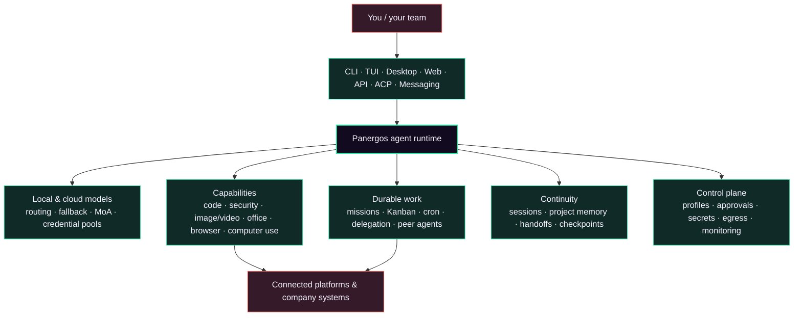

<p align="center">
  
</p>

<h1 align="center">Panergos Agent</h1>

<p align="center">
  <strong>One open agent runtime for coding, research, authorized security, media production, operations, and long-running team workflows.</strong><br>
  Bring a local or cloud model. Work from the CLI, TUI, desktop, web, API, or your existing chat platforms.
</p>

<p align="center">
  <a href="https://github.com/khajaaijaz26/panergos-agent/actions/workflows/ci.yaml"></a>
  <a href="https://github.com/khajaaijaz26/panergos-agent/actions/workflows/panergos-ci.yml"></a>
  <a href="https://github.com/khajaaijaz26/panergos-agent/releases"></a>
  <a href="LICENSE"></a>
  <a href="https://khajaaijaz26.github.io/panergos-agent/docs/"></a>
</p>

<p align="center">
  <a href="#quick-start">Quick start</a> ·
  <a href="#what-panergos-can-do">Capabilities</a> ·
  <a href="#memory-that-does-not-reread-everything">Memory</a> ·
  <a href="#security-and-media-production">Security & media</a> ·
  <a href="#connect-models-tools-and-platforms">Connections</a> ·
  <a href="#architecture">Architecture</a> ·
  <a href="https://khajaaijaz26.github.io/panergos-agent/docs/">Docs</a>
</p>

---

## Why Panergos

**Panergos** (`pan-ER-gos`, from _pan_ + Greek _ergon_, “all work”) is a model-agnostic agent distribution built for work that lasts longer than one prompt.

|                                        | What is different                                                                                                                                                     |
| -------------------------------------- | --------------------------------------------------------------------------------------------------------------------------------------------------------------------- |
| **Resume, do not restart**             | Sessions, compact project memory, checkpoints, and durable handoffs let work continue from verified evidence instead of repeatedly loading an entire repository.      |
| **Coordinate real work**               | Durable Missions combine multi-agent task graphs, dependencies, leases, retries, review stages, shared state, messages, and an auditable event stream.                |
| **Use your model**                     | Connect a ready local runtime, Anthropic, or any OpenAI-compatible endpoint. Provider routing, fallback chains, credential pools, and Mixture of Agents are built in. |
| **Work where you already are**         | Use the CLI, modern TUI, native desktop app, web dashboard, headless API, ACP clients, MCP clients, or more than 30 messaging and automation adapters.                |
| **Extend without rebuilding the core** | Skills, plugins, toolsets, MCP servers, shell hooks, and platform adapters use discoverable registries with explicit enablement and trust boundaries.                 |
| **Keep claims testable**               | Implemented, experimental, and planned capabilities are labeled separately. Comparative superiority is not claimed without reproducible benchmarks.                   |

> [!IMPORTANT]
> Panergos has no fixed task taxonomy, but it does not bypass operating-system permissions, provider limits, budgets, laws, safety controls, or human approval gates. Capability depends on the model, tools, accounts, and permissions you configure.

## Quick start

### Linux, macOS, WSL2, or Termux

```bash
curl -fsSL https://raw.githubusercontent.com/khajaaijaz26/panergos-agent/main/scripts/install.sh | bash
panergos model --quick
panergos doctor
panergos
```

### Windows PowerShell

```powershell
iex (irm https://raw.githubusercontent.com/khajaaijaz26/panergos-agent/main/scripts/install.ps1)
panergos model --quick
panergos doctor
panergos
```

`panergos model --quick` detects a ready local runtime first. It can also guide you through Anthropic or an OpenAI-compatible endpoint while keeping secret values out of `config.yaml` and shell history.

<details>
<summary><strong>Install from source</strong></summary>

```bash
git clone --branch main --single-branch https://github.com/khajaaijaz26/panergos-agent.git
cd panergos-agent
uvx --from uv==0.9.28 uv sync --locked --python 3.11
uv run --frozen panergos setup
uv run --frozen panergos
```

For development dependencies:

```bash
uvx --from uv==0.9.28 uv sync --locked --python 3.11 --extra dev
```

</details>

## What Panergos can do

| Area                              | Built-in path                                                                                                                                                                                                       |
| --------------------------------- | ------------------------------------------------------------------------------------------------------------------------------------------------------------------------------------------------------------------- |
| **Software engineering**          | Inspect and edit repositories, run terminals and tests, use Git worktrees, review changes, browse documentation, call language servers, operate GitHub, delegate parallel tasks, and retain project handoffs.       |
| **Research and knowledge work**   | Browse and search, collect cited evidence, analyze files and datasets, work with PDFs, documents, spreadsheets, presentations, notes, and configured knowledge systems.                                             |
| **Authorized cybersecurity**      | Review source and dependencies, investigate incidents and open-source evidence, scan approved targets, validate web vulnerabilities inside a written allowlist, preserve evidence, and produce remediation reports. |
| **Creative and media production** | Generate or edit images, create text/image/reference-to-video assets, produce presenter and animation projects, add voice, captions, music, and effects, then render, verify, and package the result.               |
| **Office and company operations** | Coordinate finance, HR, sales, marketing, support, procurement, legal/compliance, operations, product, analytics, engineering, IT, security, management, and executive review through accountable work packages.    |
| **Communication**                 | Connect WhatsApp, WhatsApp Cloud, Telegram, Discord, Slack, Signal, Matrix, email, SMS, Teams, Google Chat, LINE, IRC, webhooks, and other installed adapters.                                                      |
| **Automation**                    | Run one-shot jobs, schedules, webhooks, background processes, Kanban workers, multi-agent missions, peer gateways, and approval-aware external actions.                                                             |
| **Computer and browser work**     | Use browser automation, a real browser profile, and the cross-platform Computer Use backend when installed and permitted.                                                                                           |
| **Custom capabilities**           | Discover and install skills, plugins, bundles, MCP servers, platform adapters, hooks, and custom tools without hard-coding them into the agent loop.                                                                |
| **Operations and governance**     | Profiles, encrypted credential storage, external secret sources, egress controls, approvals, audit logs, monitoring, backups, diagnostics, emergency pause, and safe mode.                                          |

Panergos can draft, analyze, coordinate, and execute across these areas. External actions still require the relevant connector, authenticated account, permissions, and any configured human approval.

## Memory that does not reread everything

Project Memory is designed for large, ongoing codebases:

- **Incremental sync** reads only new or changed eligible text files.
- **Compact retrieval** uses a local SQLite FTS5 index and returns bounded snippets with file and line evidence.
- **Durable handoffs** save completed work, pending work, and the next verified step for a future session.
- **Session continuity** combines transcripts, search, compaction, prompt caching, checkpoints, and workspace-aware resume.
- **Private by default** keeps the index under the active local profile, outside the repository.
- **Defensive indexing** excludes ignored files, common vendor/cache trees, secrets, binaries, oversized files, and escaping symlinks.

```text
changed files → incremental local index → bounded file:line evidence → agent context
completed work → durable handoff → next session verifies and continues
```

Run the published microbenchmark and inspect dated raw trials in [`benchmarks/project-memory`](benchmarks/project-memory/README.md).

## Durable multi-agent missions

Enable the included mission plugin for the profile that will coordinate long-running work:

```bash
panergos plugins enable panergos_missions
panergos gateway start
```

The model receives one `panergos_mission` interface for:

- persistent mission lifecycle and restart recovery;
- task graphs backed by Panergos Kanban workers;
- dependencies, claims, leases, retries, review, workspaces, and artifacts;
- typed shared state with compare-and-swap version checks;
- idempotent, addressed peer messages and recipient-only acknowledgement;
- a keyset-paginated audit stream containing mission and task events;
- durable stop fences and quarantine for recoverable cancellation.

Durable Missions is experimental in `0.1.0`. Its policy layer applies through the mission interface; trusted callers using raw Kanban APIs can bypass that layer, and mission-level resource budgets remain a roadmap item.

## Professional organization workflows

The bundled `organization-workflows` skill turns an objective into accountable work packages across individual, manager, department, and executive scopes.

Every package separates **Draft → Review → Execute → Evidence**. Money movement, contracts, employment decisions, access changes, and external publishing require exact approval from an authenticated accountable human. Missing connectors, permissions, reviewers, or evidence are reported—not invented.

Covered role families include:

`Finance` · `HR` · `Sales` · `Marketing` · `Support` · `Operations` · `Procurement` · `Legal & Compliance` · `Engineering` · `IT` · `Security` · `Product` · `Analytics` · `Management` · `Executive coordination`

### Campaigns that create and publish in one workflow

The optional `digital-marketing` skill carries a campaign from objective, audience research, channel plan, and measurement design through copy, images, videos, review, exact approval, publication, and provider read-back. It discovers the live connector, plugin, MCP, and provider-tool inventory instead of assuming an account exists.

```bash
panergos skills install official/productivity/digital-marketing
panergos connect
```

Where a configured route exposes write access, Panergos can upload the approved assets and publish or schedule them from the same campaign workflow. X media publishing can route through `xurl`; other destinations use their enabled connector, plugin, MCP server, provider API, or a permitted authenticated-browser flow. Every claimed publication must have a returned platform ID, URL, or delivery record. A channel with no safe write route ends as an upload-ready `handed_off` package—not a fictional success.

## Security and media production

### Authorized cybersecurity

For ethical-hacking and defensive-security work, Panergos can combine repository analysis, terminal and browser tools, dependency and supply-chain checks, OSINT/forensics skills, and a phased web-pentest workflow. Active testing requires explicit authorization and a machine-readable target allowlist; redirects and nested targets are checked again, ambiguous hosts fail closed, and findings require reproducible evidence.

```bash
panergos skills search web-pentest
panergos skills search forensics
```

Panergos does not authorize intrusion into third-party systems, evade scope controls, deploy malware, or turn an unsafe request into an approved engagement.

### Images, video, and end-to-end creative work

Select an installed image or video backend in `panergos tools`. The agent can then call `image_generate` for text-to-image and supported image edits, or `video_generate` for text-to-video, image-to-video, and reference-to-video. Provider plugins cover OpenAI, OpenRouter, FAL, xAI, Krea, DeepInfra, Meta, and other installed backends; the live model catalog and supported parameters come from the selected provider.

Production skills extend generation into complete workflows: creative brief and storyboard, parallel asset creation, presenter/lip-sync production, Manim animation, voice and music, deterministic FFmpeg editing, captions, visual and audio QA, final encodes, contact sheets, and delivery evidence.

```bash
panergos tools                 # choose Image Generation or Video Generation
panergos skills search video   # discover production workflows
```

Local renderers and open models can avoid API fees when installed on suitable hardware. Hosted image/video models and remote GPUs remain subject to their provider's credentials, credits, quotas, and terms.

## Connect models, tools, and platforms

### Run locally with zero API fees—or connect cloud models

| Route                   | Setup                                                                                             | Notes                                                                                                                                                                                   |
| ----------------------- | ------------------------------------------------------------------------------------------------- | --------------------------------------------------------------------------------------------------------------------------------------------------------------------------------------- |
| **Ready local runtime** | `panergos model --quick --provider local`                                                         | Detects Ollama, LM Studio, llama.cpp, or the Panergos-managed runtime. CPU-only use is supported when the model fits memory; speed and context still depend on hardware and model size. |
| **Anthropic**           | `panergos model --quick --provider anthropic`                                                     | Guided API-key or supported account authentication. Provider access and charges still apply.                                                                                            |
| **OpenAI-compatible**   | `panergos model --quick --provider openai-compatible --base-url URL --model ID --key-env ENV_VAR` | Works with compatible local servers, self-hosted inference, and cloud endpoints without placing the key value in command history.                                                       |
| **Advanced routing**    | `panergos model`, `panergos fallback`, `panergos moa`, `panergos auth`                            | Interactive catalogs, fallback providers, Mixture of Agents, and pooled credentials.                                                                                                    |

Local inference has no Panergos usage fee and can run CPU-only when the selected model fits memory; a compatible GPU is optional and usually much faster. Panergos can also connect to a remote OpenAI-compatible GPU endpoint, but it is a client and orchestrator—not a free cloud-GPU provider. Local hardware still consumes RAM, storage, CPU/GPU time, and electricity, while hosted compute may charge separately.

### Build a model with Model Foundry

The optional `model-foundry` skill links data rights and quality, tokenizer and architecture choice, a low-cost smoke run, resumable checkpoints, held-out evaluation, safety review, packaging, serving, and the final Panergos connection. Its included deterministic character-bigram trainer proves the artifact lifecycle in seconds on a CPU with only the Python standard library; it is explicitly not presented as a production language model.

```bash
panergos skills install official/mlops/model-foundry
python "${PANERGOS_SKILL_DIR}/scripts/tiny_model_smoke.py" --output ./model-foundry-smoke
```

Existing expert skills route larger work to custom tokenizer training, TorchTitan pretraining, PEFT/LoRA/QLoRA and preference tuning, evaluation, quantization, registries, llama.cpp, and vLLM. Educational tiny runs can take minutes to hours, fine-tuning commonly takes hours to days, and production pretraining can take days to months depending on data, parameters, hardware, failures, and evaluation depth.

### Connectors and accounts

```bash
panergos connect
panergos connect status --json
panergos connect whatsapp
panergos connect whatsapp-cloud
panergos connect auth anthropic --type oauth
```

The v0.1 clean-profile catalog exposes 33 adapters. `panergos connect` reads the live built-in and enabled-plugin registries, reports readiness and missing requirement names without printing secret values, and delegates setup to each connector’s canonical flow. New platforms can be added through the connector/plugin interfaces, MCP servers, or scoped provider tools without placing credentials in the core repository. Platform APIs, permissions, geography, account tier, and terms still determine which read, upload, publish, and scheduling actions are available.

### Skills, plugins, and MCP

```bash
panergos skills search <query>
panergos plugins list
panergos tools
panergos mcp
```

Skills provide on-demand instructions and workflows; plugins can add tools, commands, hooks, platforms, and providers; MCP connects external tool servers. Disabled or unavailable capabilities stay out of the active tool surface until selected.

## Choose your interface

| Experience                     | Command                   |
| ------------------------------ | ------------------------- |
| Classic interactive CLI        | `panergos`                |
| Modern terminal UI             | `panergos --tui`          |
| One-shot scripts and pipes     | `panergos -z "your task"` |
| Web dashboard                  | `panergos dashboard`      |
| Native desktop app             | `panergos desktop`        |
| Headless backend / API         | `panergos serve`          |
| Messaging gateway              | `panergos gateway start`  |
| Agent Client Protocol server   | `panergos acp`            |
| MCP management and server mode | `panergos mcp`            |

Sessions are shared through the configured profile, so the same durable work can move between supported surfaces without starting from zero.

`panergos dashboard` opens the local React workspace at `http://127.0.0.1:9119` by default. It combines sessions, files, models, analytics, memory, jobs, skills, plugins, MCP, channels, credentials, configuration, and the real Panergos TUI in an embedded terminal on supported PTY/ConPTY installations. The default Panergos Eclipse interface uses the Panergos Knot with eclipse plum, electric jade, signal coral, and orbit amber; light, alternate, and user-defined themes remain available.

## Architecture



| Path                          | Responsibility                                                                   |
| ----------------------------- | -------------------------------------------------------------------------------- |
| `agent/`                      | Agent loop, model transports, context, delegation, memory, and reliability logic |
| `panergos_cli/`               | CLI commands, setup, profiles, dashboard backend, security, and operations       |
| `tui_gateway/`                | TUI/desktop gateway protocol and session workers                                 |
| `tools/`                      | Tool registry and built-in tool implementations                                  |
| `gateway/`                    | Messaging adapters and multi-platform routing                                    |
| `skills/`, `optional-skills/` | Bundled and opt-in capability instructions                                       |
| `plugins/`, `plugin-catalog/` | Runtime extensions and catalog metadata                                          |
| `apps/desktop/`               | Native desktop shell                                                             |
| `website/`                    | Documentation and public capability catalogs                                     |

## Security and trust

- Dangerous operations remain approval-aware unless the operator explicitly changes policy.
- Profiles isolate configuration, sessions, memory, connectors, and secrets.
- Secret status reports names and readiness, never credential values.
- Authenticated non-loopback HTTP endpoints are rejected by quick setup.
- External secret sources, an encrypted local vault, egress credential injection, pairing controls, supply-chain checks, and private vulnerability reporting are available.
- `panergos --safe-mode` disables user customization, rules, plugins, and MCP for troubleshooting.
- `panergos pause` stops new cron/Kanban dispatch and gateway turns as an emergency control.

Read the [security guide](website/docs/user-guide/security.md) and report vulnerabilities through [GitHub’s private advisory form](https://github.com/khajaaijaz26/panergos-agent/security/advisories/new).

## Delivery status

| Capability                                                                                                                    | Status           | Evidence                                                         |
| ----------------------------------------------------------------------------------------------------------------------------- | ---------------- | ---------------------------------------------------------------- |
| Core CLI, TUI, desktop, web, API, ACP, model routing, tools, skills, plugins, MCP, cron, gateways, and delegation             | **Implemented**  | Cross-platform CI, integration suites, and release gates         |
| Model quick start and unified connector inventory                                                                             | **Implemented**  | Focused CLI contracts and clean-profile tests                    |
| Model Foundry lifecycle and dependency-free CPU smoke trainer                                                                 | **Implemented**  | Focused skill contract and deterministic artifact test           |
| Image generation/editing, plugin-routed video generation, and end-to-end production skills                                    | **Implemented**  | Provider contracts, tool tests, and bundled/optional workflows   |
| Governed digital campaigns with configured-route publication and read-back evidence                                            | **Implemented**  | Optional workflow contract and focused ordering/evidence tests   |
| Scope-locked web security assessment and defensive investigation workflows                                                    | **Implemented**  | Authorization contract, target allowlist, evidence-first reports |
| Organization workflow pack                                                                                                    | **Implemented**  | Bundled role pack, approval/evidence contract, and focused tests |
| Durable Missions                                                                                                              | **Experimental** | Local contract, concurrency, recovery, and distribution tests    |
| Project Memory                                                                                                                | **Experimental** | Focused tests and published synthetic microbenchmark             |
| Capability Forge, Policy Ledger, unified Evidence Gates, mission budgets, signed installers, and comparative agent benchmarks | **Roadmap**      | Specifications or acceptance criteria only                       |

Future work is tracked in the public [Post-v0.1 roadmap](https://github.com/khajaaijaz26/panergos-agent/milestone/1). Panergos will not claim to outperform another agent until a reproducible evaluation publishes prompts, pinned builds and model settings, graders, repeated trials, failures, cost, and latency.

## Documentation

- **[Documentation site](https://khajaaijaz26.github.io/panergos-agent/docs/)** — guides, concepts, platform setup, skills, and references
- **[Project guide](PANERGOS.md)** — missions, memory, connectors, reliability boundaries, and commands
- **[Installation](website/docs/getting-started/installation.md)** — platform-specific installation and updates
- **[Model quick start](website/docs/getting-started/model-quickstart.md)** — local, Anthropic, and OpenAI-compatible setup
- **[Messaging platforms](website/docs/user-guide/messaging/index.md)** — connector-specific guides
- **[MCP](website/docs/user-guide/features/mcp.md)** — external tool servers
- **[Contributing](CONTRIBUTING.md)** — development setup and contribution workflow
- **[Visual identity](BRAND.md)** — Panergos Knot and brand palette

Translations: [Español](README.es.md) · [简体中文](README.zh-CN.md) · [اردو](README.ur-pk.md)

## Community

- [Discussions](https://github.com/khajaaijaz26/panergos-agent/discussions) for ideas and usage questions
- [Issues](https://github.com/khajaaijaz26/panergos-agent/issues) for reproducible bugs and scoped feature requests
- [Security advisories](https://github.com/khajaaijaz26/panergos-agent/security/advisories/new) for private vulnerability reports

## License

Panergos Agent is distributed under the [Apache License 2.0](LICENSE). Required third-party attribution and bundled component licenses are preserved in [NOTICE](NOTICE), [LICENSE-MIT-UPSTREAM](LICENSE-MIT-UPSTREAM), and component notice/license files.
