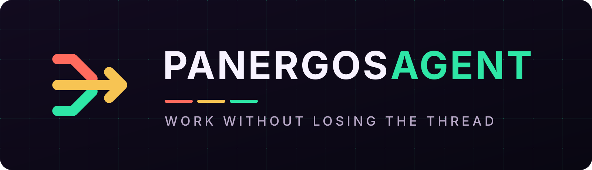
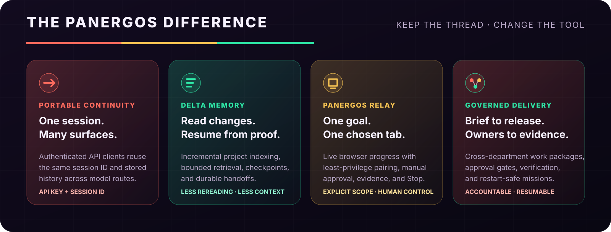

<p align="center">
  
</p>

<h1 align="center">Panergos Agent</h1>

<p align="center">
  <strong>One open agent runtime for coding, research, authorized security, media production, operations, and long-running team workflows.</strong><br>
  Bring a local or cloud model. Work from the CLI, TUI, desktop, web, API, or your existing chat platforms.
</p>

<p align="center">
  <a href="https://github.com/khajaaijaz26/panergos-agent/actions/workflows/ci.yaml"></a>
  <a href="https://github.com/khajaaijaz26/panergos-agent/actions/workflows/panergos-ci.yml"></a>
  <a href="https://github.com/khajaaijaz26/panergos-agent/releases"></a>
  <a href="LICENSE"></a>
  <a href="https://khajaaijaz26.github.io/panergos-agent/docs/"></a>
</p>

<p align="center">
  <a href="#quick-start">Quick start</a> ·
  <a href="#current-build-interface-and-model-highlights">What's new</a> ·
  <a href="#portable-continuity-across-clients-and-models">Continuity</a> ·
  <a href="#open-the-native-desktop-app">Desktop app</a> ·
  <a href="#what-panergos-can-do">Capabilities</a> ·
  <a href="#memory-that-does-not-reread-everything">Memory</a> ·
  <a href="#security-and-media-production">Security & media</a> ·
  <a href="#connect-models-tools-and-platforms">Connections</a> ·
  <a href="#architecture">Architecture</a> ·
  <a href="https://khajaaijaz26.github.io/panergos-agent/docs/">Docs</a>
</p>

---

## Product highlights

**Panergos** (`pan-ER-gos`, from _pan_ + Greek _ergon_, “all work”) is a model-agnostic agent distribution built for work that lasts longer than one prompt. These are working product paths, not future-feature claims; experimental surfaces are labeled.

| Highlight | Why it matters | Delivery |
| --- | --- | --- |
| **[Portable continuity across clients and models](#portable-continuity-across-clients-and-models)** | Authenticate to one Panergos instance, reuse an explicit session ID from another compatible client, and continue its persisted history on the same or a different configured model route. | **Implemented** |
| **[Memory-first continuity](#memory-that-does-not-reread-everything)** | Incremental Project Memory, checkpoints, compact retrieval, and durable handoffs continue from verified evidence instead of repeatedly loading an entire repository. | **Experimental** |
| **[Durable multi-agent missions](#durable-multi-agent-missions)** | Persistent task graphs add dependencies, leases, retries, review stages, typed shared state, peer messages, restart recovery, and an auditable event stream. | **Experimental** |
| **[Model choice with automatic recovery](#connect-models-tools-and-platforms)** | Use a ready local runtime, Anthropic, or an OpenAI-compatible endpoint, then combine fallback chains, credential pools, and Mixture of Agents without manually switching every failed route. | **Implemented** |
| **One runtime across every surface** | Use the same configured Panergos runtime from the CLI, modern TUI, native desktop app, web dashboard, headless API, ACP/MCP clients, and more than 30 messaging and automation adapters. | **Implemented** |
| **[Create, approve, publish, and verify](#professional-organization-workflows)** | Governed marketing and media workflows can produce assets, request exact approval, publish through a configured write route, and retain the returned platform ID, URL, or delivery record. | **Implemented** |
| **[Company-to-release coordination](#company-industry-and-product-delivery)** | A built-in work-package route coordinates software, web/app/game, education, film/media, marketing, freelance, finance, and cross-industry delivery. Execution depends on installed tools, connected accounts, and required approval. | **Implemented** |
| **[Professional work with explicit boundaries](#security-and-trust)** | Organization workflows, authorized-security scope locks, secret controls, approval gates, and evidence requirements keep consequential actions attributable. | **Implemented** |
| **Visible speed and cost controls** | The TUI reports cache hit rate, rolling latency, output tokens per second, and `/fast` state; route selection can optimize latency or throughput when the provider supports it. | **Implemented** |
| **Extensible without rebuilding the core** | Skills, plugins, toolsets, MCP servers, shell hooks, and platform adapters use discoverable registries with explicit enablement and trust boundaries. | **Implemented** |

<p align="center">
  
</p>

### What is materially different here

Panergos is designed around a durable work thread instead of a single chat window. Its differentiators are composable product paths, not an unsupported claim that every capability is exclusive:

- **Portable continuity:** the API key authenticates the caller and the explicit session ID selects the exact Panergos-owned conversation. Compatible clients can hand that session across surfaces without sharing provider cookies or confusing two conversations that use the same key.
- **Model-independent resume:** a persisted session can be resumed and routed to another configured provider or model. Panergos reloads its own stored history and runtime metadata; it does not pretend to import private chat history from a provider account.
- **Delta memory:** Project Memory indexes changed eligible files and retrieves bounded evidence instead of rereading an entire repository for every turn.
- **Scoped browser execution:** Panergos Relay pairs with a short-lived code, binds one user-selected tab and origin, opens ordinary anchors without executing page click handlers, shows live work, and provides an immediate Stop control.
- **Governed delivery:** work packages connect departments, artifacts, approvals, evidence, and release handoffs while durable missions retain dependencies and restart state.

## Current build: interface and model highlights

| New or improved path | Highlight | How to use it |
| --- | --- | --- |
| **Full terminal provider catalog** | `/model` now exposes all **53 canonical provider routes in this build** (plus installed extensions), keeps ready routes selectable, labels unconfigured routes as **Connect**, and never attempts to run an unconfigured provider. | Enter `/model`, then type any part of a provider name to filter the list. |
| **Simple provider connection** | API-key, account-sign-in, local-runtime, and custom OpenAI-compatible paths reuse the canonical setup flow; secrets stay out of `config.yaml` and are redacted after storage. | Run `panergos model`, or open **Models → Connect a model** in the browser/desktop interface. |
| **Automatic model recovery** | Ordered fallback can move to another configured route after supported quota, rate-limit, or availability failures without repeated manual switching. | Open **Models → Automatic fallback** or run `panergos fallback`. |
| **Native desktop launcher** | `panergos desktop` builds only when needed, then opens the native shell directly; later launches use a content stamp to skip unchanged builds. | Run `panergos desktop`. |
| **Readable desktop scale** | Fresh installs and **Actual Size / Ctrl+0** now use **110%**; Appearance presets and native zoom controls remain available. | Open **Settings → Appearance → UI scale**. |
| **Native keep-awake** | Electron's native app-suspension blocker can prevent computer sleep so active work continues while the display dims, locks, or turns off; Panergos does not keep the display awake. | Open **Settings → Advanced** and enable **Keep Panergos working when screen is off**. |
| **Centered terminal startup** | The terminal reveals the large Panergos wordmark one letter at a time in a fixed, centered upper stage, uses responsive fallbacks for narrower terminals, and leaves the completed name visible above the working interface. | Launch `panergos`; use a wide terminal for the full six-row wordmark. |
| **Native desktop appearance** | Panergos Eclipse uses eclipse plum, signal coral, relay amber, and electric jade instead of a single-color surface. Built-in themes, light/dark/system mode, live theme search, VS Code Marketplace theme installation, terminal font, session density, tab defaults, and supported glass/translucency controls are available. | Open **Settings → Appearance**; use its theme search to filter installed themes or install another one. |
| **Browser command workspace** | The local dashboard uses a searchable Command Map, full-width Focus Stage, bottom Launch Bay, and compact Continuity Lane instead of a permanent admin sidebar. | Run `panergos dashboard`, then open `http://127.0.0.1:9119`; press `Ctrl/Cmd+K` for Navigation. |
| **Live browser themes and fonts** | The dashboard palette switcher changes color roles, typography, density, corner radius, terminal colors, and supported custom theme assets immediately. Built-in and user YAML themes persist, while the font override can be changed independently. | Press `Ctrl/Cmd+K`, then use the palette control in Navigation; choose a theme and font. |
| **Panergos Relay browser extension** | A one-prompt side panel binds one explicitly selected tab and origin, streams progress, keeps a visible Stop control, uses native navigation instead of page click handlers, and refuses protected or recognized-sensitive targets. | Enable browser extension control, load `apps/browser-extension` as an unpacked extension, then run `panergos extension pair --origin chrome-extension://<id>`. |
| **Terminal command discovery** | Slash completion and a searchable command palette expose the available commands without memorizing them. | Type `/` then Tab, or press `Ctrl+P`; choose a command, then press Enter to run it. |

The capability, memory, media, security, organization, connector, and delivery sections below describe the rest of the implemented and experimental feature set; status labels are kept visible so roadmap work is not presented as shipped.

> [!IMPORTANT]
> Panergos has no fixed task taxonomy, but it does not bypass operating-system permissions, provider limits, budgets, laws, safety controls, or human approval gates. Capability depends on the model, tools, accounts, and permissions you configure.

## Quick start

### Linux, macOS, WSL2, or Termux

```bash
curl -fsSL https://raw.githubusercontent.com/khajaaijaz26/panergos-agent/main/scripts/install.sh | bash
panergos model --quick
panergos doctor
panergos
```

### Windows PowerShell

```powershell
iex (irm https://raw.githubusercontent.com/khajaaijaz26/panergos-agent/main/scripts/install.ps1)
panergos model --quick
panergos doctor
panergos
```

`panergos model --quick` detects a ready local runtime first. It can also guide you through Anthropic or an OpenAI-compatible endpoint while keeping secret values out of `config.yaml` and shell history.

### Open the native desktop app

After the platform-specific installation above, run:

```text
panergos desktop
```

For a fresh Windows installation, the complete PowerShell flow is:

```powershell
# Install Panergos once
iex (irm https://raw.githubusercontent.com/khajaaijaz26/panergos-agent/main/scripts/install.ps1)

# Build if needed, then open the native app
panergos desktop
```

The first desktop launch may install its dependencies and build the packaged app. Later launches compare a content stamp and, when the app is current, skip the build and open it directly. No browser URL is required.

> [!NOTE]
> The v0.1 source release does not yet publish a prebuilt GUI installer. The working cross-platform launcher is `panergos desktop`; packaged installer downloads and automatic shortcuts will be documented when those release artifacts are published.

### Run Panergos Relay in Chrome or Edge

Panergos Relay is a dependency-free Manifest V3 side panel in [`apps/browser-extension`](apps/browser-extension). It uses a restricted, origin-bound credential instead of exposing the full `API_SERVER_KEY` to the extension.

1. Enable the local API server and browser controller:

   ```yaml
   browser:
     extension_control:
       enabled: true
   ```

   ```bash
   # ~/.panergos/.env
   API_SERVER_ENABLED=true
   API_SERVER_KEY=replace-with-a-strong-random-secret
   ```

2. Run `panergos gateway`. In `chrome://extensions` or `edge://extensions`, enable Developer mode, choose **Load unpacked**, and select `apps/browser-extension`.
3. Open the Panergos Relay side panel and copy the displayed extension origin. Generate its 120-second, one-use pairing code:

   ```bash
   panergos extension pair --origin chrome-extension://<extension-id>
   ```

4. Paste the code, choose **Use this page**, enter one goal, and follow the live progress. The pairing grant lasts up to eight hours in the browser session and is revoked by disconnect or API-server restart.

The extension refuses protected browser pages, literal and recognized local/private/metadata destinations, secret-looking text, fields whose DOM metadata identifies password/OTP/payment use, CAPTCHA, forms, buttons, and recognizable consequential targets. It opens eligible anchors through native tab navigation rather than page click handlers and requires **Use this page** again after a cross-origin move. Before a tab is bound, it installs tab-scoped Manifest V3 block rules and revalidates the loaded URL after navigation. Browser URL filtering cannot prove where a public hostname resolves, so DNS rebinding remains outside this v0.1 boundary; secret recognition and page metadata are also heuristics. Do not treat Relay as a standalone network-isolation, SSRF, or hostile-page sandbox. Enter every confidential value and complete sensitive or consequential steps manually. See the [browser extension guide](website/docs/user-guide/features/browser-extension.md).

<details>
<summary><strong>Install from source</strong></summary>

```bash
git clone --branch main --single-branch https://github.com/khajaaijaz26/panergos-agent.git
cd panergos-agent
uvx --from uv==0.9.28 uv sync --locked --python 3.11
uv run --frozen panergos setup
uv run --frozen panergos
```

For development dependencies:

```bash
uvx --from uv==0.9.28 uv sync --locked --python 3.11 --extra dev
```

</details>

## What Panergos can do

| Area                              | Built-in path                                                                                                                                                                                                       |
| --------------------------------- | ------------------------------------------------------------------------------------------------------------------------------------------------------------------------------------------------------------------- |
| **Software engineering**          | Inspect and edit repositories, run terminals and tests, use Git worktrees, review changes, browse documentation, call language servers, operate GitHub, delegate parallel tasks, and retain project handoffs.       |
| **Research and knowledge work**   | Browse and search, collect cited evidence, analyze files and datasets, work with PDFs, documents, spreadsheets, presentations, notes, and configured knowledge systems.                                             |
| **Authorized cybersecurity**      | Review source and dependencies, investigate incidents and open-source evidence, scan approved targets, validate web vulnerabilities inside a written allowlist, preserve evidence, and produce remediation reports. |
| **Creative and media production** | Generate or edit images, create text/image/reference-to-video assets, produce presenter and animation projects, add voice, captions, music, and effects, then render, verify, and package the result.               |
| **Product and client delivery**    | Coordinate a client brief or product objective through design, implementation, tests, review, release artifacts, configured deployment or a submission-ready handoff, evidence, and resumable continuity.       |
| **Office and company operations** | Coordinate finance, HR, sales, marketing, support, procurement, legal/compliance, operations, product, analytics, engineering, IT, security, management, and executive review through accountable work packages.    |
| **Education and data work**       | Support school and university planning, teaching and faculty workflows, student services, education data analysis, data engineering, and software engineering through accountable work packages and configured systems. |
| **Communication**                 | Connect WhatsApp, WhatsApp Cloud, Telegram, Discord, Slack, Signal, Matrix, email, SMS, Teams, Google Chat, LINE, IRC, webhooks, and other installed adapters.                                                      |
| **Automation**                    | Run one-shot jobs, schedules, webhooks, background processes, Kanban workers, multi-agent missions, peer gateways, and approval-aware external actions.                                                             |
| **Computer and browser work**     | Use browser automation, a real browser profile, and the cross-platform Computer Use backend when installed and permitted.                                                                                           |
| **Custom capabilities**           | Discover and install skills, plugins, bundles, MCP servers, platform adapters, hooks, and custom tools without hard-coding them into the agent loop.                                                                |
| **Operations and governance**     | Profiles, encrypted credential storage, external secret sources, egress controls, approvals, audit logs, monitoring, backups, diagnostics, emergency pause, and safe mode.                                          |

Panergos can draft, analyze, coordinate, and execute across these areas. External actions still require the relevant connector, authenticated account, permissions, and any configured human approval.

## Portable continuity across clients and models

The **API key proves who may access the Panergos instance; the session ID identifies which conversation to continue**. Keeping those roles separate prevents one shared key from accidentally opening the wrong conversation.

From any compatible client pointed at the same Panergos server and profile:

```bash
# Discover the session on the first client or another authorized surface.
curl http://127.0.0.1:8642/api/sessions?limit=20 \
  -H "Authorization: Bearer $API_SERVER_KEY"

# Continue that exact stored session from a second client.
curl http://127.0.0.1:8642/v1/runs \
  -H "Authorization: Bearer $API_SERVER_KEY" \
  -H "Content-Type: application/json" \
  -d '{"input":"Continue from the last verified step.","session_id":"SESSION_ID"}'
```

When `SESSION_ID` already exists and the request does not replace its history, Panergos loads the persisted conversation before running the new turn. A client may select another configured model route for a later turn while retaining the Panergos session; provider credentials are resolved again instead of being copied into the transcript. `X-Panergos-Session-Key` can additionally keep the long-term memory scope stable when a frontend rotates transcript IDs.

This transfers **Panergos-owned state** across authorized API clients. It does not extract a proprietary ChatGPT, Claude, Gemini, or other provider's private account history merely from that provider's API key.

## Memory that does not reread everything

Project Memory is designed for large, ongoing codebases:

- **Incremental sync** reads only new or changed eligible text files.
- **Compact retrieval** uses a local SQLite FTS5 index and returns bounded snippets with file and line evidence.
- **Durable handoffs** save completed work, pending work, and the next verified step for a future session.
- **Session continuity** combines transcripts, search, compaction, prompt caching, checkpoints, and workspace-aware resume.
- **Private by default** keeps the index under the active local profile, outside the repository.
- **Defensive indexing** excludes ignored files, common vendor/cache trees, secrets, binaries, oversized files, and escaping symlinks.

```text
changed files → incremental local index → bounded file:line evidence → agent context
completed work → durable handoff → next session verifies and continues
```

Run the published microbenchmark and inspect dated raw trials in [`benchmarks/project-memory`](benchmarks/project-memory/README.md).

## Durable multi-agent missions

Enable the included mission plugin for the profile that will coordinate long-running work:

```bash
panergos plugins enable panergos_missions
panergos gateway start
```

The model receives one `panergos_mission` interface for:

- persistent mission lifecycle and restart recovery;
- task graphs backed by Panergos Kanban workers;
- dependencies, claims, leases, retries, review, workspaces, and artifacts;
- typed shared state with compare-and-swap version checks;
- idempotent, addressed peer messages and recipient-only acknowledgement;
- a keyset-paginated audit stream containing mission and task events;
- durable stop fences and quarantine for recoverable cancellation.

Durable Missions is experimental in `0.1.0`. Its policy layer applies through the mission interface; trusted callers using raw Kanban APIs can bypass that layer, and mission-level resource budgets remain a roadmap item.

## Professional organization workflows

The bundled `organization-workflows` skill turns an objective into accountable work packages across individual, manager, department, and executive scopes.

Every package separates **Draft → Review → Execute → Evidence**. Money movement, contracts, employment decisions, access changes, and external publishing require exact approval from an authenticated accountable human. Missing connectors, permissions, reviewers, or evidence are reported—not invented.

Covered role families include:

`Finance` · `HR` · `Sales` · `Marketing` · `Support` · `Operations` · `Procurement` · `Legal & Compliance` · `Engineering` · `IT` · `Security` · `Product` · `Analytics` · `Management` · `Executive coordination`

### Company, industry, and product delivery

The organization workflow is a coordination router, not a list of job-title demos. It selects the relevant domain skills and connected systems, divides the objective into owned work packages, preserves approvals and dependencies, and requires evidence before any item is reported complete.

Availability is explicit: the orchestration skill and core repository/browser/terminal routes are built in; named optional skills must be installed; external systems require a configured connector or official toolchain; consequential decisions and store acceptance remain with the authorized human and provider.

| Workstream | End-to-end route |
| --- | --- |
| **Software company and product teams** | Discovery → architecture → backlog → implementation → automated tests → security/QA review → release → monitoring and support handoff, using repository tools, `test-driven-development`, `systematic-debugging`, `github`, `sdlc-review`, missions, and Project Memory when available. |
| **Websites and web apps** | Requirements → content and visual system → implementation → accessibility/performance/functional QA → approved versioned deployment → live-URL verification. The optional `publish-site` workflow supports GitHub Pages, Cloudflare Pages, and Netlify for compatible projects. |
| **Mobile and desktop apps** | Product brief → platform implementation → device/build testing → privacy and store assets → signed release artifact → account-owner approval → store submission → review-status and post-release verification. The required SDKs, signing identities, developer account, and store permissions must be configured. |
| **Games** | Game design brief → prototype → code/content production → playtesting and performance QA → package → configured distribution or publisher handoff. `p5js` supports browser prototypes and `unreal-mcp` can automate exposed Unreal Editor tasks; a complete title still depends on the project's engine, assets, SDKs, and publisher tooling. Console SDK access is never assumed. |
| **Film and media** | Brief → research/script → storyboard → generated or imported media through installed creative tools → edit/assembly, voice, music, captions, and effects → rights/accessibility/technical QA → master files → approved upload-ready package or configured delivery evidence. |
| **Digital marketing** | Research → campaign and funnel → copy/images/video → brand, rights, and claims review → exact publication approval → connected publishing → read-back IDs/URLs → measurement and iteration through the optional `digital-marketing` workflow. |
| **Freelance and agency work** | Client intake → scope and acceptance criteria → estimate/milestones → production → review and revisions → approved delivery/deployment → evidence, invoice-support handoff, and reusable project memory. Contracts, price commitments, invoices, and client-account writes remain approval-gated. |
| **Finance and corporate departments** | Source-controlled analysis, reconciliations, forecasts, models, reports, and cross-department decision-support packs through `xlsx` and the optional finance skills. Payments, filings, trading, tax/accounting conclusions, and material financial decisions require the configured system and qualified human authority. |
| **Education and other industries** | Apply the same owned Draft → Review → Execute → Evidence contract to education, healthcare, manufacturing, retail, logistics, government, nonprofit, professional services, technology, or another sector while substituting its real regulations, qualified reviewers, systems of record, and acceptance tests. This adapter does not supply sector expertise, authorization, or professional qualification. |

A ready, authorized route lets Panergos execute its supported steps; a missing proprietary tool, account, credential, permission, SDK, reviewer, or legal right becomes an explicit `blocked` or `handed_off` item. It never converts a generated file into a claim that a real company system or public store was changed.

#### Website, app, and game release path

Panergos ships no built-in Apple, Google Play, Microsoft Store, Steam, or universal store-publisher connector. It can prepare a release and, when a store's official tooling, API, or permitted authenticated portal is exposed to the session, assist or run only those authorized steps; otherwise it produces a submission-ready handoff. The common contract is **build → test → sign → approve → submit → capture provider status → verify release → preserve rollback and handoff**.

| Destination | Current route and required boundary |
| --- | --- |
| **Web and cloud** | Use the project's existing CI/cloud tooling or install `official/web-development/publish-site` for supported static deployments. Domain, billing, DNS, production-data, and infrastructure mutations use the connected owner's permissions and approval policy. |
| **Apple App Store** | Build and sign with the Apple toolchain, upload to App Store Connect, complete metadata, select the build, and submit through an authorized role. The account owner supplies identity, agreements, tax/banking facts, signing authority, and final commercial decisions; Apple controls processing and App Review. See [Apple's upload](https://developer.apple.com/help/app-store-connect/manage-builds/upload-builds) and [submission](https://developer.apple.com/help/app-store-connect/manage-submissions-to-app-review/submit-an-app) workflows. |
| **Google Play** | Produce and sign the Android App Bundle, configure Play App Signing/listing/testing, create the release, and submit with the required Play Console permission. The account owner supplies verified identity, declarations, fees where applicable, and final release authority; Google controls policy review and publication status. See the official [release](https://support.google.com/googleplay/android-developer/answer/9859348) and [publishing](https://support.google.com/googleplay/android-developer/answer/9859751) workflows. |
| **Microsoft Store** | Reserve the product, prepare an MSIX/PWA or supported game package and listing, submit through an authorized Partner Center account, then track certification. Account/business verification, agreements, commercial terms, and certification remain external. See [Microsoft's publishing guide](https://learn.microsoft.com/windows/apps/publish/). |
| **Steam** | With an onboarded Steamworks partner account and app ID, prepare the store/build checklists and upload through official tooling; an authorized publisher submits for Valve review and performs the final release after approval. See the official [Steam release options](https://partner.steamgames.com/doc/store/types). |
| **Other and console stores** | Use that store's approved developer program, SDK, signing materials, account roles, policy forms, and review process. If those are not exposed to the session, Panergos stops at a verified submission-ready handoff. |

Example request:

```text
Use organization-workflows to take this product from brief to release.
Create owned work packages for design, engineering, QA, marketing, finance, and launch;
use only connected accounts; stop at every required approval; verify every external result;
and leave a resumable handoff for anything blocked or still in store review.
```

### Education and data work

The expanded `organization-workflows` skill covers schools, universities, teachers and faculty, principals and school leaders, student services, education data analysis, data engineering, software engineering, and a generic cross-industry adapter for organizations outside the named role families.

Decisions affecting students or staff require accountable human approval. Privacy, retention, safeguarding, and FERPA-like requirements depend on the institution and jurisdiction, and live work in an LMS, SIS, data platform, code host, or other external system requires the relevant configured connector, account, permissions, and review path.

### Campaigns that create and publish in one workflow

The optional `digital-marketing` skill carries a campaign from objective, audience research, channel plan, and measurement design through copy, images, videos, review, exact approval, publication, and provider read-back. It discovers the live connector, plugin, MCP, and provider-tool inventory instead of assuming an account exists.

```bash
panergos skills install official/productivity/digital-marketing
panergos connect
```

Where a configured route exposes write access, Panergos can upload the approved assets and publish or schedule them from the same campaign workflow. X media publishing can route through `xurl`; other destinations use their enabled connector, plugin, MCP server, provider API, or a permitted authenticated-browser flow. Every claimed publication must have a returned platform ID, URL, or delivery record. A channel with no safe write route ends as an upload-ready `handed_off` package—not a fictional success.

## Security and media production

### Authorized cybersecurity

For ethical-hacking and defensive-security work, Panergos can combine repository analysis, terminal and browser tools, dependency and supply-chain checks, OSINT/forensics skills, and a phased web-pentest workflow. Active testing requires explicit authorization and a machine-readable target allowlist; redirects and nested targets are checked again, ambiguous hosts fail closed, and findings require reproducible evidence.

```bash
panergos skills search web-pentest
panergos skills search forensics
```

Panergos does not authorize intrusion into third-party systems, evade scope controls, deploy malware, or turn an unsafe request into an approved engagement.

### Images, video, and end-to-end creative work

Select an installed image or video backend in `panergos tools`. The agent can then call `image_generate` for text-to-image and supported image edits, or `video_generate` for text-to-video, image-to-video, and reference-to-video. Provider plugins cover OpenAI, OpenRouter, FAL, xAI, Krea, DeepInfra, Meta, and other installed backends; the live model catalog and supported parameters come from the selected provider.

Production skills extend generation into complete workflows: creative brief and storyboard, parallel asset creation, presenter/lip-sync production, Manim animation, voice and music, deterministic FFmpeg editing, captions, visual and audio QA, final encodes, contact sheets, and delivery evidence.

```bash
panergos tools                 # choose Image Generation or Video Generation
panergos skills search video   # discover production workflows
```

Local renderers and open models can avoid API fees when installed on suitable hardware. Hosted image/video models and remote GPUs remain subject to their provider's credentials, credits, quotas, and terms.

## Connect models, tools, and platforms

### Run locally with zero API fees—or connect cloud models

| Route                   | Setup                                                                                             | Notes                                                                                                                                                                                   |
| ----------------------- | ------------------------------------------------------------------------------------------------- | --------------------------------------------------------------------------------------------------------------------------------------------------------------------------------------- |
| **Ready local runtime** | `panergos model --quick --provider local`                                                         | Detects Ollama, LM Studio, llama.cpp, or the Panergos-managed runtime. CPU-only use is supported when the model fits memory; speed and context still depend on hardware and model size. |
| **Anthropic**           | `panergos model --quick --provider anthropic`                                                     | Guided API-key or supported account authentication. Provider access and charges still apply.                                                                                            |
| **OpenAI-compatible**   | `panergos model --quick --provider openai-compatible --base-url URL --model ID --key-env ENV_VAR` | Works with compatible local servers, self-hosted inference, and cloud endpoints without placing the key value in command history.                                                       |
| **Advanced routing**    | `panergos model`, `panergos fallback`, `panergos moa`, `panergos auth`                            | Interactive catalogs, fallback providers, Mixture of Agents, and pooled credentials.                                                                                                    |

In the browser dashboard, open **Models → Connect a model**, choose a provider, paste its API key, and select **Connect**. Panergos validates the key, discovers the provider's models, and selects a sensible default for new sessions; keys are redacted after saving and never copied into `config.yaml`. Self-hosted and OpenAI-compatible servers remain available under **Advanced: custom endpoint**.

### Verified free model access with automatic fallback

<h3 align="center">1B+ CUMULATIVE LOCAL TOKENS</h3>
<p align="center"><strong>No Panergos-imposed per-token usage cap for self-hosted inference.</strong><br />This is cumulative usage over time—not one context window or a free cloud-provider grant—and remains limited by the selected model, runtime, hardware, storage, electricity, and time.</p>

> [!IMPORTANT]
> **There is no verified “billions of free tokens” pool to advertise, and not every model has a free allowance.** Providers publish different request limits, per-model rate ceilings, temporary offers, credits, and account-specific quotas. Panergos can connect those routes and switch automatically, but it cannot merge them into one guaranteed token balance.

Verified against provider documentation on **2026-09-21**. Connect more than one route, then set the order once under **Models → Automatic fallback** (or with `panergos fallback`). After that, Panergos moves to the next configured model after a supported quota, rate-limit, or availability failure—no manual switching. It does not combine balances or bypass provider limits.

| Provider route | Official free or included allowance | Honest token reading |
| --- | --- | --- |
| **OpenRouter** — built-in sign-in or API key | [25+ free models and 50 requests/day](https://openrouter.ai/pricing) | Requests are not tokens; OpenRouter publishes no fixed free-token total. |
| **OpenCode Zen** — built-in API key | The [live pricing page](https://opencode.ai/docs/zen/) lists several limited-time models with free input and output. | The free catalog can change and no fixed token quota is published; use the live model list shown by Panergos. |
| **Google Gemini API** — built-in API key | Selected models have [free input and output tokens](https://ai.google.dev/gemini-api/docs/pricing); [limits vary by project and model](https://ai.google.dev/gemini-api/docs/rate-limits). | No universal token total; AI Studio shows the active RPM, TPM, and daily limits for the account. |
| **Groq** — custom OpenAI-compatible endpoint | The [Free Plan table](https://console.groq.com/docs/rate-limits) lists 200K tokens/day, 8K tokens/minute, and 1,000 requests/day for each of `openai/gpt-oss-120b`, `openai/gpt-oss-20b`, and `qwen/qwen3.8-27b`. | **200K tokens/day per listed model** is a rate ceiling, not a promised grant; organization limits and whichever limit is reached first apply. |
| **Cerebras** — custom OpenAI-compatible endpoint | The [Free Trial limits](https://inference-docs.cerebras.ai/support/rate-limits) currently list 1M tokens/day for each of `gpt-oss-120b` and `qwen-3.8-27b`. | **1M tokens/day per named trial model** is a rate ceiling; the trial requires a verified payment method and is bounded by $5 in credits that expire after 30 days. |
| **Hugging Face** — built-in token | [Monthly credits](https://huggingface.co/docs/inference-providers/pricing): $0.10 for Free, $2 for PRO, and $2 per Team/Enterprise seat. | Dollar credits cannot be converted to one token number because model and provider prices differ. |
| **Mistral Studio** — custom OpenAI-compatible endpoint | [Free mode needs no credit card](https://docs.mistral.ai/getting-started/quickstarts/studio/activate-and-generate-api-key), but its [RPS, tokens/minute, and tokens/month limits](https://help.mistral.ai/en/articles/698531-why-am-i-hitting-api-rate-limits-and-how-do-i-increase-them) are shown in the signed-in Limits page. | No fixed public token amount. |
| **GitHub Copilot** — built-in account sign-in | [Copilot Free includes an unspecified AI-credit allowance and automatic model selection](https://docs.github.com/en/copilot/get-started/plans); paid individual plans include 1,500, 7,000, or 20,000 monthly AI credits. | AI credits are not API tokens; the separate 2,000 IDE-completion allowance is not Panergos model usage, and access depends on the account entitlement. |

**Largest verified figures above:** 200K tokens/day on each cited Groq model and 1M tokens/day on each cited Cerebras trial model. These are separate per-model rate ceilings—not a guaranteed combined allowance, and Cerebras does not offer a renewing free tier. There is no defensible universal subtotal across providers, so Panergos does not advertise “billions of free tokens.” Provider catalogs, limits, eligibility, geography, and terms can change; check the linked source and the account's live limits before relying on a number.

Local inference has no Panergos usage fee and can run CPU-only when the selected model fits memory; a compatible GPU is optional and usually much faster. Panergos can also connect to a remote OpenAI-compatible GPU endpoint, but it is a client and orchestrator—not a free cloud-GPU provider. Local hardware still consumes RAM, storage, CPU/GPU time, and electricity, while hosted compute may charge separately.

### Build a model with Model Foundry

The optional `model-foundry` skill links data rights and quality, tokenizer and architecture choice, a low-cost smoke run, resumable checkpoints, held-out evaluation, safety review, packaging, serving, and the final Panergos connection. Its included deterministic character-bigram trainer proves the artifact lifecycle in seconds on a CPU with only the Python standard library; it is explicitly not presented as a production language model.

```bash
panergos skills install official/mlops/model-foundry
python "${PANERGOS_SKILL_DIR}/scripts/tiny_model_smoke.py" --output ./model-foundry-smoke
```

Existing expert skills route larger work to custom tokenizer training, TorchTitan pretraining, PEFT/LoRA/QLoRA and preference tuning, evaluation, quantization, registries, llama.cpp, and vLLM. Educational tiny runs can take minutes to hours, fine-tuning commonly takes hours to days, and production pretraining can take days to months depending on data, parameters, hardware, failures, and evaluation depth.

### Connectors and accounts

```bash
panergos connect
panergos connect status --json
panergos connect whatsapp
panergos connect whatsapp-cloud
panergos connect auth anthropic --type oauth
```

The v0.1 clean-profile catalog exposes 33 adapters. `panergos connect` reads the live built-in and enabled-plugin registries, reports readiness and missing requirement names without printing secret values, and delegates setup to each connector’s canonical flow. New platforms can be added through the connector/plugin interfaces, MCP servers, or scoped provider tools without placing credentials in the core repository. Platform APIs, permissions, geography, account tier, and terms still determine which read, upload, publish, and scheduling actions are available.

### Skills, plugins, and MCP

```bash
panergos skills search <query>
panergos plugins list
panergos tools
panergos mcp
```

Skills provide on-demand instructions and workflows; plugins can add tools, commands, hooks, platforms, and providers; MCP connects external tool servers. Disabled or unavailable capabilities stay out of the active tool surface until selected.

## Choose your interface

| Experience                     | Command                   |
| ------------------------------ | ------------------------- |
| Classic interactive CLI        | `panergos`                |
| Modern terminal UI             | `panergos --tui`          |
| One-shot scripts and pipes     | `panergos -z "your task"` |
| Web dashboard                  | `panergos dashboard`      |
| Native desktop app             | `panergos desktop`        |
| Headless backend / API         | `panergos serve`          |
| Messaging gateway              | `panergos gateway start`  |
| Agent Client Protocol server   | `panergos acp`            |
| MCP management and server mode | `panergos mcp`            |

Sessions are shared through the configured profile, so the same durable work can move between supported surfaces without starting from zero.

`panergos dashboard` opens the local React workspace at `http://127.0.0.1:9119` by default. Select **Navigation** or press `Ctrl/Cmd+K` to open its searchable Command Map, which reaches sessions, files, models, automation, connections, configuration, and installed plugin pages without a permanent admin sidebar. Chat keeps the real Panergos TUI in a full-width Focus Stage; select **Model & tools** to raise its model, tool, and session controls in the bottom Launch Bay. The terminal starts with a compact Continuity Lane for model, route, workspace, memory, real throughput signals, and commands. The default Panergos Eclipse interface uses the Panergos Relay with eclipse plum, signal coral, relay amber, and electric jade; light, alternate, and user-defined themes remain available.

Panergos reduces the latency it controls through stable prompt prefixes and provider caching, bounded memory retrieval instead of full-project rereads, parallel independent tools, cached catalogs, and route-aware model selection. `/fast` can request supported provider priority tiers and may cost more; OpenRouter can explicitly sort by latency or throughput. Panergos does not claim it can make a remote provider's hardware itself run faster.

## Architecture

```text
You + your team
       │
       ▼
CLI · TUI · Desktop · Web · API · ACP · Messaging
       │
       ▼
╭──────────────────── Panergos Agent runtime ────────────────────╮
│ Models       local/cloud routing · fallback · Mixture of Agents │
│ Capabilities code · security · media · office · browser         │
│ Work         missions · Kanban · cron · delegation · peers      │
│ Continuity   sessions · project memory · handoffs · checkpoints │
│ Control      profiles · approvals · secrets · egress · monitors │
╰─────────────────────────────────────────────────────────────────╯
       │
       ▼
Connected platforms and company systems
```

| Path                          | Responsibility                                                                   |
| ----------------------------- | -------------------------------------------------------------------------------- |
| `agent/`                      | Agent loop, model transports, context, delegation, memory, and reliability logic |
| `panergos_cli/`               | CLI commands, setup, profiles, dashboard backend, security, and operations       |
| `tui_gateway/`                | TUI/desktop gateway protocol and session workers                                 |
| `tools/`                      | Tool registry and built-in tool implementations                                  |
| `gateway/`                    | Messaging adapters and multi-platform routing                                    |
| `skills/`, `optional-skills/` | Bundled and opt-in capability instructions                                       |
| `plugins/`, `plugin-catalog/` | Runtime extensions and catalog metadata                                          |
| `apps/desktop/`               | Native desktop shell                                                             |
| `website/`                    | Documentation and public capability catalogs                                     |

## Security and trust

- Dangerous operations remain approval-aware unless the operator explicitly changes policy.
- Profiles isolate configuration, sessions, memory, connectors, and secrets.
- Secret status reports names and readiness, never credential values.
- Authenticated non-loopback HTTP endpoints are rejected by quick setup.
- External secret sources, an encrypted local vault, egress credential injection, pairing controls, supply-chain checks, and private vulnerability reporting are available.
- `panergos --safe-mode` disables user customization, rules, plugins, and MCP for troubleshooting.
- `panergos pause` stops new cron/Kanban dispatch and gateway turns as an emergency control.

Read the [security guide](website/docs/user-guide/security.md) and report vulnerabilities through [GitHub’s private advisory form](https://github.com/khajaaijaz26/panergos-agent/security/advisories/new).

## Delivery status

| Capability                                                                                                                    | Status           | Evidence                                                         |
| ----------------------------------------------------------------------------------------------------------------------------- | ---------------- | ---------------------------------------------------------------- |
| Core CLI, TUI, desktop, web, API, ACP, model routing, tools, skills, plugins, MCP, cron, gateways, and delegation             | **Implemented**  | Cross-platform CI, integration suites, and release gates         |
| Model quick start and unified connector inventory                                                                             | **Implemented**  | Focused CLI contracts and clean-profile tests                    |
| Model Foundry lifecycle and dependency-free CPU smoke trainer                                                                 | **Implemented**  | Focused skill contract and deterministic artifact test           |
| Image generation/editing, plugin-routed video generation, and end-to-end production skills                                    | **Implemented**  | Provider contracts, tool tests, and bundled/optional workflows   |
| Governed digital campaigns with configured-route publication and read-back evidence                                            | **Implemented**  | Optional workflow contract and focused ordering/evidence tests   |
| Scope-locked web security assessment and defensive investigation workflows                                                    | **Implemented**  | Authorization contract, target allowlist, evidence-first reports |
| Cross-industry company-to-release workflow pack                                                                                | **Implemented**  | Bundled role/delivery packs, approval/evidence contract, and focused tests |
| Durable Missions                                                                                                              | **Experimental** | Local contract, concurrency, recovery, and distribution tests    |
| Project Memory                                                                                                                | **Experimental** | Focused tests and published synthetic microbenchmark             |
| Capability Forge, Policy Ledger, unified Evidence Gates, mission budgets, signed installers, and comparative agent benchmarks | **Roadmap**      | Specifications or acceptance criteria only                       |

Future work is tracked in the public [Post-v0.1 roadmap](https://github.com/khajaaijaz26/panergos-agent/milestone/1). Panergos will not claim to outperform another agent until a reproducible evaluation publishes prompts, pinned builds and model settings, graders, repeated trials, failures, cost, and latency.

## Documentation

- **[Documentation site](https://khajaaijaz26.github.io/panergos-agent/docs/)** — guides, concepts, platform setup, skills, and references
- **[Project guide](PANERGOS.md)** — missions, memory, connectors, reliability boundaries, and commands
- **[Installation](website/docs/getting-started/installation.md)** — platform-specific installation and updates
- **[Model quick start](website/docs/getting-started/model-quickstart.md)** — local, Anthropic, and OpenAI-compatible setup
- **[Messaging platforms](website/docs/user-guide/messaging/index.md)** — connector-specific guides
- **[MCP](website/docs/user-guide/features/mcp.md)** — external tool servers
- **[Contributing](CONTRIBUTING.md)** — development setup and contribution workflow
- **[Visual identity](BRAND.md)** — Panergos Relay and brand palette

Translations: [Español](README.es.md) · [简体中文](README.zh-CN.md) · [اردو](README.ur-pk.md)

## Community

- [Discussions](https://github.com/khajaaijaz26/panergos-agent/discussions) for ideas and usage questions
- [Issues](https://github.com/khajaaijaz26/panergos-agent/issues) for reproducible bugs and scoped feature requests
- [Security advisories](https://github.com/khajaaijaz26/panergos-agent/security/advisories/new) for private vulnerability reports

## License

Panergos Agent is distributed under its own [MIT License](LICENSE), Copyright © 2026 Shaik Khaja Aijaz Ahmed. Required third-party attribution is consolidated in [NOTICE](NOTICE) and component notice/license files; those terms apply only to their respective inherited or bundled portions.
